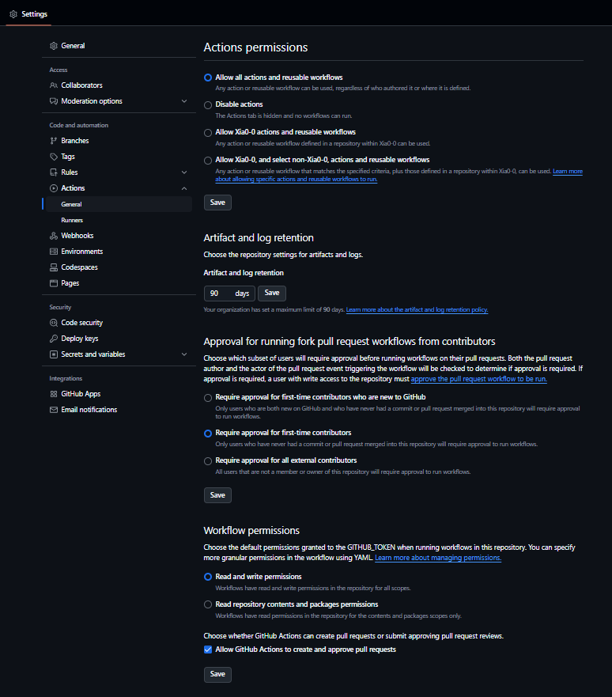
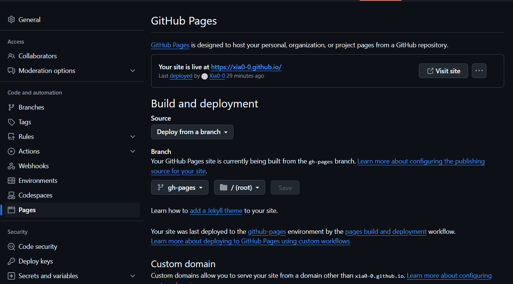
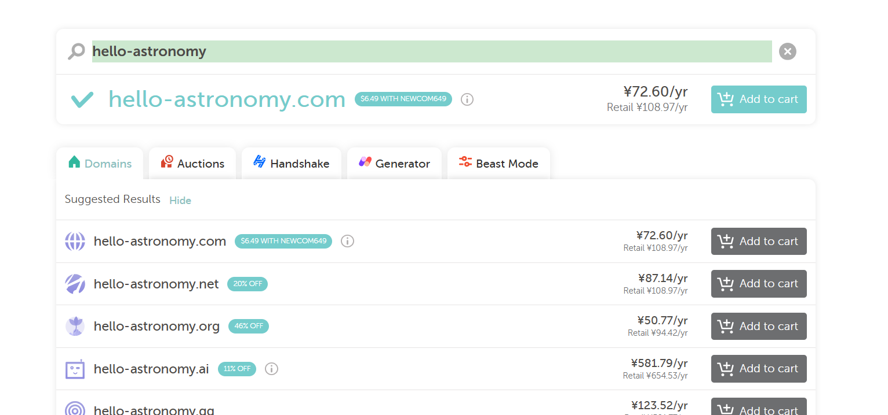

- GitHub pages

--  action给予权限（自动化部署要用）

合并请求通过，应该会自动化部署

--  pages改下

- 自定义域名

Hello-Astronomy（推荐😂🙌）

这个竟然还没人注册

- .Giscus配置（评论区）
https://giscus.app/zh-CN
按网址操作就行了
discussions在仓库setting>general中（所有者）
剩下的代码操作，我来操作，这个替换成本仓库的。

  

